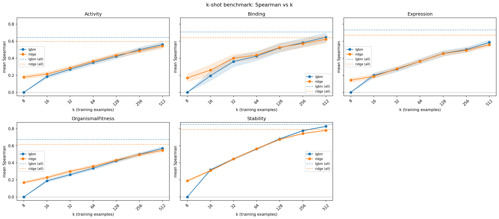
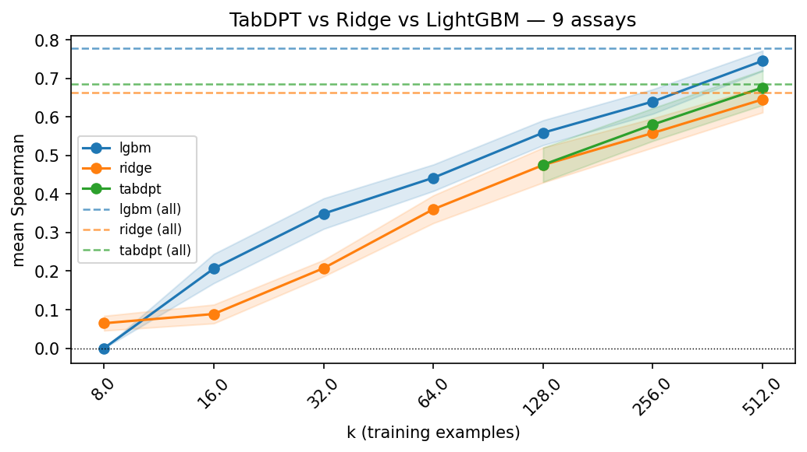

## Overview

This project studies few-shot protein fitness prediction on the ProteinGym benchmark [1]. We pose the following question: *how many labeled mutants are required to reliably predict the fitness of unseen mutations?*

Rather than assuming access to thousands of assay measurements, we sweep over absolute training sizes k ∈ {8, 16, 32, 64, 128, 256, 512, all} and evaluate performance across all 217 single-substitution assays in ProteinGym v1.3.

---

## Methods

**Features.** Each variant is represented as a tabular row derived from ESM-2 (650M) embeddings of the wild-type sequence; no per-variant forward passes are required. Features include the per-residue embedding at the mutation site, a mean-pooled local window embedding, amino acid identity one-hots, normalized position, and physicochemical deltas (hydrophobicity, volume, charge). In total, there are ~2,600 features. See the [appendix](#appendix-feature-descriptions) for the full feature list.

**Evaluation.** For each assay we use the official ProteinGym `fold_random_5` splits as the outer CV structure. For each outer fold (held-out test set), k examples are sampled uniformly from the remaining 4 folds, models are fit on that subset, and predictions are made on the held-out fold. Held-out predictions are concatenated across all 5 folds to compute assay-level Spearman correlation. This is repeated for every k value.

**Models.** We explore the following models:
- **Ridge regression** — alpha selected via efficient leave-one-out CV (`RidgeCV`).
- **LightGBM** — gradient boosted trees with fixed moderate complexity (`n_estimators=100`, `num_leaves=15`, `min_child_samples=5`, `colsample_bytree=0.3`).
- **TabDPT** [2] — a tabular foundation model with in-context learning capabilities, evaluated selectively on assays identified as having nonlinear fitness landscapes (see below).

---

## Results

### k-shot scaling

Mean Spearman correlation across all 217 assays, averaged over 5 CV folds:

| k | Ridge | LightGBM |
|---|---|---|
| 8 | 0.174 | 0.000 |
| 16 | 0.248 | 0.227 |
| 32 | 0.344 | 0.325 |
| 64 | 0.427 | 0.415 |
| 128 | 0.514 | 0.510 |
| 256 | 0.578 | 0.594 |
| 512 | 0.627 | 0.658 |
| all | 0.670 | 0.727 |

Ridge dominates at low k, likely due to its L2 regularization being well-suited to the wide, sparse regime. The models converge around k=128 and LightGBM overtakes at k=256+, reflecting its stronger capacity to capture nonlinear structure once sufficient data is available. At k=128, both models achieve ~0.51 Spearman — roughly 70% of the full-data LightGBM ceiling.

> Numbers can be reproduced via `python scripts/analysis.py` (`print_summary_stats`).

### Stratification by selection type



Performance varies substantially by assay type. Stability assays are consistently the most predictable, with LightGBM at k=64 on stability (0.561) already exceeding its performance on activity assays at k=512 (0.559). This likely reflects the smoother, more linear fitness landscape of thermodynamic stability relative to binding or organismal fitness, which are more susceptible to epistasis and context dependence.

Note that the full-data ceilings (dashed lines) are not true upper bounds; zero-shot or cross-assay models may exceed it in some cases.

### TabDPT on nonlinear assays

To probe when in-context learning adds value, we identified assays where LightGBM most outperforms Ridge (proxy for nonlinear feature relationships) and evaluated TabDPT on that subset (9 assays). Only k ≥ 128 is feasible given TabDPT's context requirements.

| k | Ridge | LightGBM | TabDPT |
|---|---|---|---|
| 128 | 0.475 | 0.559 | 0.476 |
| 256 | 0.558 | 0.640 | 0.580 |
| 512 | 0.645 | 0.745 | 0.676 |
| all | 0.663 | 0.778 | 0.685 |



TabDPT consistently outperforms Ridge on these nonlinear assays but does not match LightGBM. This suggests in-context learning captures some nonlinear structure that Ridge misses, but gradient boosting remains the stronger inductive bias for this feature regime (high-dimensional, dense ESM-2 embeddings).

> Numbers can be reproduced via `python scripts/analysis_tabdpt.py` (`print_tabdpt_summary_stats`).

---

## Limitations

- **Within-assay ceiling.** The "all" data point trains on ~80% of a single assay. In practice, supervised models trained across many proteins or combined with zero-shot ESM-2 log-likelihoods would likely outperform this ceiling.
- **No zero-shot baseline.** ESM-2 masked marginal log-likelihoods are a strong zero-shot predictor and would provide useful context for interpreting the k-shot curves.
- **Singles only.** Multi-mutant variants are excluded to avoid confounding from pooled site embeddings.
- **Fixed feature set.** Intermediate ESM-2 layer representations, global pooling strategies, mutant-WT embedding deltas were not explored in this analysis.

## References

[1] Notin, P., Kollasch, A., Ritter, D., van Niekerk, L., Paul, S., Spinner, H., Rollins, N., Shaw, A., Weitzman, R., Frazer, J., Dias, M., Franceschi, D., Orenbuch, R., Gal, Y., & Marks, D. S. (2023). ProteinGym: Large-Scale Benchmarks for Protein Fitness Prediction and Design. *Advances in Neural Information Processing Systems*, 36. https://www.biorxiv.org/content/10.1101/2023.12.07.570727v1

[2] Ma, J., Thomas, N., Hollmann, N., Müller, S., Hutter, F., & Garnett, R. (2024). TabDPT: Scaling Tabular Foundation Models on Real Data. *Advances in Neural Information Processing Systems*, 38. https://arxiv.org/abs/2410.18164

---

## Appendix: Feature descriptions

Metadata:
- `file_id`: assay identifier (stem of DMS_filename, e.g. `A0A140D2T1_ZIKV_Sourisseau_2019`)
- `UniProt_ID`: UniProt accession of the WT protein
- `mutant`: single-substitution mutation string, e.g. `A42V`
- `L_res`: length of the WT sequence (number of residues)
- `DMS_score`: experimental fitness score (continuous)
- `DMS_score_bin`: binarized fitness label

Mutation identity + position features:
- `pos_mean_norm`: mutation position normalized by sequence length
- `aa_from_<AA>` (x20): one-hot encoding of the original amino acid at the mutation site
- `aa_to_<AA>` (x20): one-hot encoding of the resulting amino acid at the mutation site
- `delta_hydro`: hydrophobicity delta (mutant - original AA, Kyte-Doolittle)
- `delta_vol`: volume delta (mutant - original AA, Zamyatnin)
- `delta_charge`: formal charge delta (mutant - original AA, at pH 7)

Local WT embeddings:
- `site_mean_<d>`: element `d` of the WT residue embedding at the mutation site
- `win_mean_<d>`: element `d` of the mean-pooled WT embeddings from the local window (length `2k + 1`) around the mutation site

---

## Running the code

### Environment setup

Install uv:
```shell
curl -LsSf https://astral.sh/uv/install.sh | sh
```

Create and install the environment:

```shell
uv venv .venv
uv sync
source .venv/bin/activate
```

### Dataset download

Create the dataset directory:

```shell
mkdir -p data/proteingym/reference_files  # from the repo root
```

Download the reference file with the non-mutated sequences by copying the file `DMS_Substitutions.csv` from [here](https://github.com/OATML-Markslab/ProteinGym/tree/37ea726885452197125f841a33320341d665bc3f/reference_files) and pasting it into `data/proteingym/reference_files`.

Download the substitutions and predefined folds:

```shell
VERSION="v1.3"
BASE="https://marks.hms.harvard.edu/proteingym/ProteinGym_${VERSION}"

# Main DMS substitutions benchmark (variants + labels)
curl -L -o DMS_ProteinGym_substitutions.zip "${BASE}/DMS_ProteinGym_substitutions.zip"
unzip -q DMS_ProteinGym_substitutions.zip -d data/proteingym
rm DMS_ProteinGym_substitutions.zip

# Official CV folds for singles
curl -L -o cv_folds_singles_substitutions.zip "${BASE}/cv_folds_singles_substitutions.zip"
unzip -q data/proteingym/cv_folds_singles_substitutions.zip -d data/proteingym
rm cv_folds_singles_substitutions.zip

# Official CV folds for multiple
curl -L -o cv_folds_multiples_substitutions.zip "${BASE}/cv_folds_multiples_substitutions.zip"
unzip -q cv_folds_multiples_substitutions.zip -d data/proteingym
rm cv_folds_multiples_substitutions.zip
```

### Core functionality

Convert WT sequences to FASTA:
```shell
python scripts/extract_wt_fasta.py
```

Generate per-residue embeddings:
```shell
python scripts/esm2_forward_features.py
```

Generate features:
```shell
python scripts/featurize.py configs/featurize_baseline.yaml
```

Run k-shot training and inference:
```shell
python scripts/train_kshot_benchmark.py
```

Run analysis and generate plots:
```shell
python scripts/analysis.py
python scripts/analysis_tabdpt.py
```
